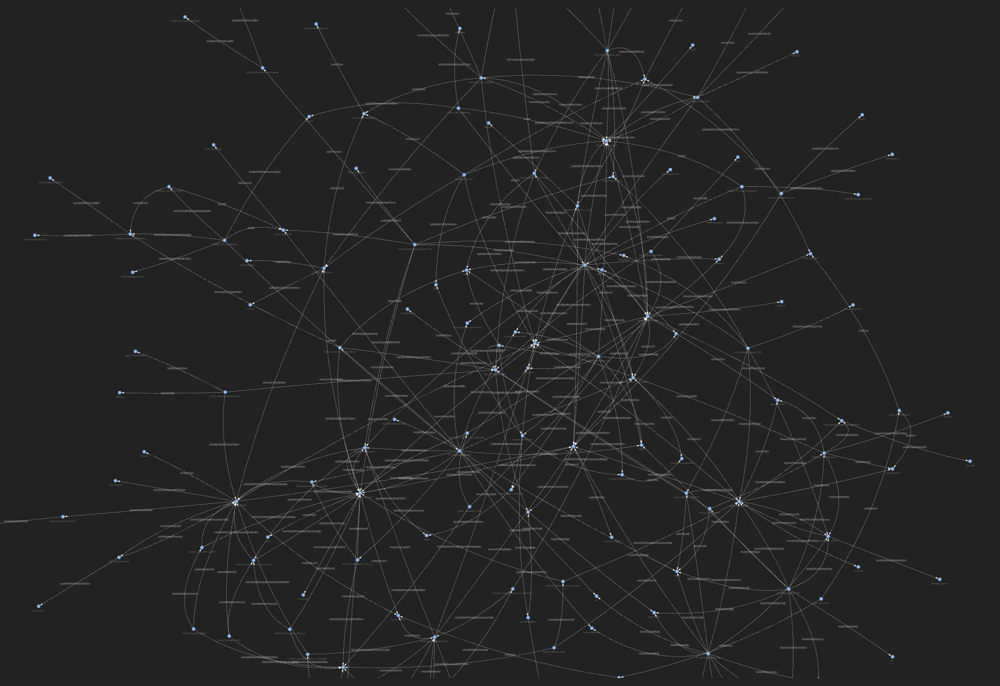
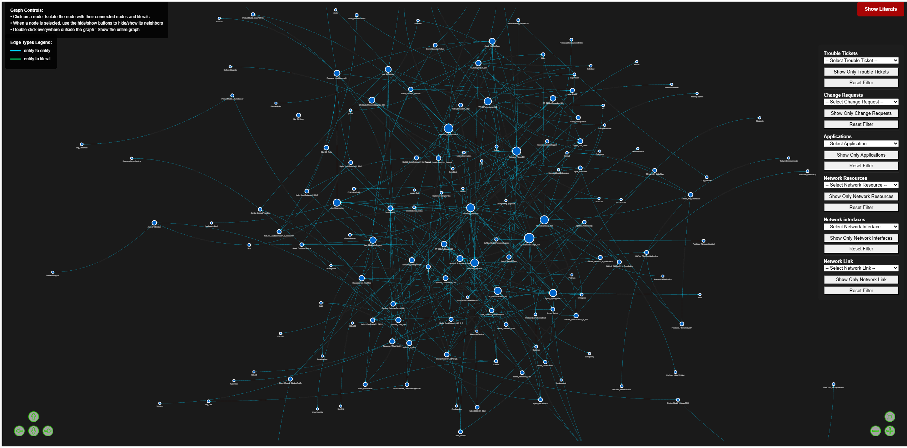

# Ontology2Graph: A Framework for Synthetic Knowledge Graph Generation Using Large Language Models.

## Abstract

Ontology2Graph is a comprehensive Python framework designed to generate synthetic Knowledge Graphs thanks to Large Language Model (LLM). The system provides a complete computational pipeline that transforms ontological schemas into semantically coherent knowledge graphs with integrated quality assurance mechanisms.

## Overview

Knowledge Graphs have emerged as fundamental structures for representing complex relationships in semantic data. This framework addresses the challenge of generating synthetic knowledge graphs at scale by leveraging the reasoning capabilities of Large Language Models while ensuring adherence to ontological constraints and semantic consistency.

Ontology2Graph implements a modular architecture that supports:
- Automated knowledge graph generation from ontological specifications
- Comprehensive graph analysis and key performance indicator computation
- Interactive visualization capabilities for structural analysis
- Graph merging and consolidation algorithms
- Quality control and validation mechanisms

## System Architecture

The framework is structured into four primary modules:

### Knowledge Graph Generation Module (`generate_ttl_files/`)

The generation module serves as the core component for synthetic knowledge graph creation. It interfaces with various Large Language Models through standardized APIs to transform ontological schemas into RDF-compliant Turtle format graphs.

**Key Components:**
- `generate_ttl.py`: Primary generation engine implementing LLM-based graph synthesis
- `utils_gen/utils.py`: Supporting utilities for model configuration, prompt management and graph validation
- Multi-model support architecture with configurable prompt strategies
- Integrated TTL syntax validation & turtle formating pipeline

### Visualization and Analysis Module (`display_graphs/`)

This module provides comprehensive analytical capabilities for knowledge graph assessment and interactive visualization generation.

**Key Components:**
- `display_graphs.py`: Main visualization engine supporting multiple rendering modes
- `utils/utils_display.py`: Analytical utilities for graph metrics computation
- Interactive HTML generation using web-based visualization libraries
- Key Performance Indicator (KPI) calculation for structural analysis
- `utils/visu_graph.py`: visualization module for basic or advanced graphs representation

### Graph Consolidation Module (`merge_ttl_files/`)

The consolidation module implements algorithms for intelligent merging of multiple knowledge graphs while maintaining semantic consistency and managing duplicate entities.

**Key Components:**
- `merge_ttl.py`: Primary merging algorithm with homonyme nodes detection
- `utils_merge/utils.py`: Specialized utilities for graph unification operations
- RDF prefix normalization and namespace management
- Post-merge validation and consistency checking

### Common Utilities Module (`utils_common/`)

Shared infrastructure components providing fundamental operations across all modules.

**Key Components:**
- `utils_common/utils.py`: Specialized utilities used by others modules
- Argument parsing and configuration management
- Logging and monitoring infrastructure
- File I/O operations and path management
- TTL validation and error handling mechanisms

## Installation and Configuration

### System Requirements

- Python 3.8 or higher
- External TTL validation tool
- External TTL formating tool
- Network connectivity for LLM API access

### Environment Setup

1. **Virtual Environment Creation:**
   ```bash
   python3 -m venv venv
   source venv/bin/activate
   ```

2. **Dependency Installation:**
   Python 3.7+
   Required packages: `requests`, `rdflib`, `openai`, `networkx`, `owlready2`; `pyvis`. Install them manually:
   ```bash
   python3 -m pip install requests rdflib openai networkx owlready2 pyvis
   ```
   or 
   ```bash
   python3 -m pip install -r requirements.txt
   ```

3. **External Tool Installation:**
   - Install the [Turtle Validator](https://github.com/IDLabResearch/TurtleValidator) for syntax validation.
   - Install the [Ontology engineering tool](https://github.com/atextor/owl-cli) for Turtle format rearrangement.

4. **API Configuration:**
   Configure LLM access credentials:
   ```bash
   export LLM_API_KEY="your_api_key"
   ```

## Usage Documentation

### Knowledge Graph Generation

The generation process requires proper configuration of model parameters and prompt strategies:

```bash
cd generate_ttl_files
python generate_ttl.py --nbrttl <number_of_graphs> --reasoner <reasoner>
```
**Parameters:**
- `number_of_graph`: The number of graphs you want to generate.
- `reasoner` : The reasonner to use for consistency checking (Pellet or HermiT)

**Configuration Parameters in generate_ttl_files:**
- `model_nbr`: Specifies the target LLM (reference: `utils_gen/models/models.json`)
- `prompt_type`: Defines the generation strategy (reference: `utils_gen/prompts/prompts.json`)

Each TTL file generated is automatically checking by [Ontology engineering tool](https://github.com/atextor/owl-cli) for Turtle format rearrangement and [Turtle Validator](https://github.com/IDLabResearch/TurtleValidator) for syntax validation. Validated files are stored in the `results/synthetic_graphs/` directory in TTL format.

### Graph Consolidation

Multiple knowledge graphs can be merged using the consolidation module:

```bash
cd merge_ttl_files
python merge_ttl.py --path_file <source_directory> --ontology <ontology_file>
```

The consolidation process generates several merged graphs that differ from each other in terms of their number of nodes and therefore their density. This process is based on the recognition of homonymous nodes, in the set of graphes generated by the LLM, and their sequential renaming from a merged graph where no homonymous are renamed to the renaming of all homonymous corresponding to the juxtaposition of graphs generated by the LLM.

Merged files are automatically checking by [Turtle Validator](https://github.com/IDLabResearch/TurtleValidator) for syntax validation. Each validated file is stored in a "merged" folder beside the LLM generated graphs.

### Graph Visualization and Analysis

The visualization module supports both basic structural rendering and advanced analytical visualization:

```bash
cd display_graphs
python display_graphs.py --path <input_path> --ontology <ontology> --mode <visualization_mode>
```

**Parameters:**
- `input_path`: Path to individual TTL files or directories containing multiple graphs
- `ontology`: Reference ontology file path
- `visualization_mode`: Either `basic` for structural visualization or `advanced` for analytical rendering  
  

**Basic view, click on it to expand:**
<div style="display: flex;">
    <div style="text-align: center;">
         <br><br>
    </div>
</div>

**Advanced view, click on it to expand**
<div style="display: flex;">
    <div style="text-align: center;">
         
    </div>
</div>

### Monitoring and Logging

The system generates comprehensive logs containing:
- Generation timestamps and model identifiers
- Token utilization metrics
- Validation results and error reports
- Performance indicators

### Core Python Dependencies

- **rdflib**: RDF graph processing and SPARQL query execution
- **networkx**: Graph algorithmic analysis and structural computation
- **pyvis**: Interactive web-based graph visualization
- **openai**: Large Language Model API integration
- **owlready2**: Ontology-oriented programming packages
- **requests**: Core HTTp library for python, used for making API calls

### Supported Formats

- **Input**: TTL (Turtle) ontology files, JSON configuration files
- **Output**: TTL knowledge graphs, HTML visualizations
- **Logging**: Structured text logs with configurable verbosity levels

### Quality Assurance

The framework implements multiple validation layers:
- Syntactic TTL validation using external tools
- Semantic consistency checking against source ontologies
- Structural analysis for graph coherence assessment
- Automated error detection and quarantine mechanisms

## Performance Considerations

### Scalability Factors

- Graph size limitations dependent on available system memory
- LLM API rate limiting considerations
- Parallel processing support for visualization rendering

## Research Applications

This framework supports various research applications in:
- Semantic data augmentation for machine learning datasets
- Ontology validation and consistency testing
- Knowledge graph structural analysis and comparison
- Synthetic data generation for privacy-preserving research

## References and Documentation

- See the [official documentation](https://orange-opensource.github.io/Ontology2Graph/): for details.
- [Turtle Validator](https://github.com/IDLabResearch/TurtleValidator): External validation tools.
- [Ontology engineering tool](https://github.com/atextor/owl-cli) for Turtle format rearrangement.
- [RDFLib Documentation](https://rdflib.readthedocs.io/): RDF processing library reference

For additional documentation and contribution guidelines, refer to [CONTRIBUTING.md](CONTRIBUTING.md).

## License and Attribution

This software is distributed under the BSD 4-Clause License; refer to the [LICENSE](LICENSE.txt) file for complete terms and conditions.
Additionally, see the [CONTRIBUTORS](CONTRIBUTORS.txt) file for the list of maintainers and contributors.
