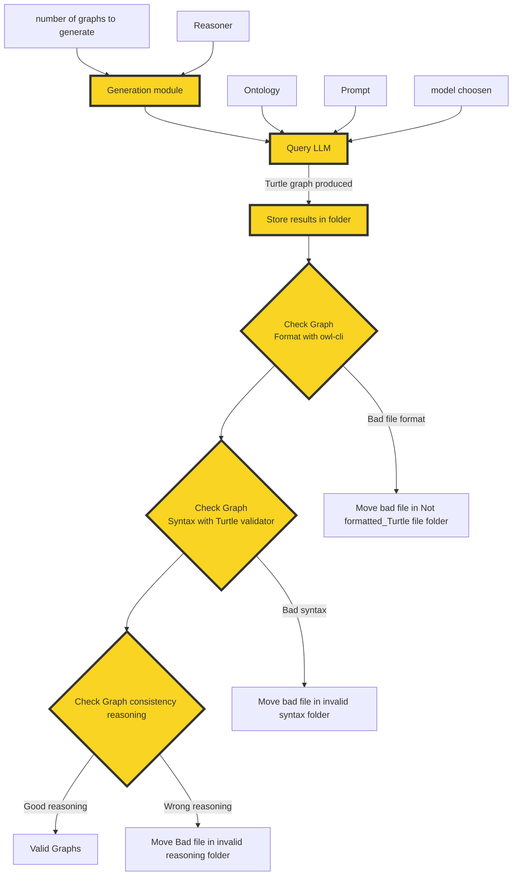

# Knowledge Graph Generation Module

The knowledge graph generation module queries a LLM to build a graph in Turtle format based on a specific provided Ontology. The prompt must be written beforehand accordingly with the ontology domain. 

## Main Components
- **generate_ttl.py** : Main script to generate one or more Turtle files using a large language (LLM) and a given ontology. Run this script from the `generate_ttl_files` directory.
- **utils_gen/utils.py** : Supporting utilities for model configuration, prompt management, querying the LLM, storing results, graph validation and managing files/folders. 

    - List of functions :

        - **query_llm**(ontology_file,prompt_file,model,prompt_type):
        - **storing_results**(response,temp_file,file_result,logger,model):
        - **model_to_choose**(model_nbr):
        - **build_folder_paths_and_files**(model):
        - **remove_file_in_folder**(folder_path):
        - **check_graph_format**(folder_path, notformated_path, logger):
        - **check_graph_reasoner**(folder_path, invalid_reasoner_path, ontology, reasoner, logger):

## Features    

- **Automated Generation:** Automated generation of Turtle files using LLM, prompt and ontology.
- **Configurable Output:** Configurable number of graphs to generate via the `--nbrttl` command-line argument.
- **Ontology Reasoner Selection:** The `--reasoner` argument specifies which ontology reasoner to use for ontological compliancy checking of the generated Turtle files. Valid values are `Pellet` or `HermiT` (case-sensitive). The reasoner will be used to check for logical inconsistencies in the generated graphs. If not set correctly, the script will raise an error.
- **Logging:** Logging of generation process and LLM usage statistics.
- **Folder & File Management:** Automatic folder and file creation for results, logs, and temporary files.
- **Validation Tools:** Each TTL file generated is automatically checked by the following tools:
    - [Ontology engineering tool](https://github.com/atextor/owl-cli) for Turtle format rearrangement
    - [Turtle Validator](https://github.com/IDLabResearch/TurtleValidator) for syntax validation
    - [Owlready2](https://owlready2.readthedocs.io/en/v0.50/) for reasoning consistency checking
- **Validated Output:** Validated files are stored in the **results/synthetic_graphs/`<`date`>`/`<`model`>`** folder
- **Cleanup Support:** Support for removing old files before new generation.

## Knowledge graph generation module Schema

