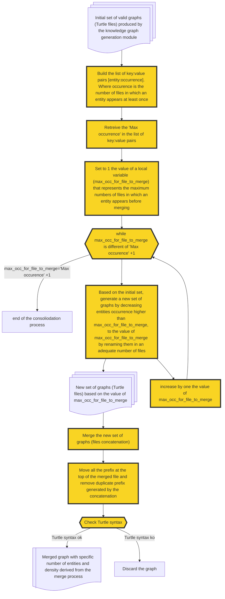

# Graph consolidation Module

In order to overcome the LLM's output token limitation, that have a direct impact on the order (number of entities) of the generated graphs. We developped this module to merge several graphs coming from the knowledge graph generation module in an only one, and so increase the order of the resulting merged graph.

The graph consolidation module processes sets of synthetic knowledge graphs in turtle format based on the merging by exact matching method on name entities. It identifies overlapping entities (homonymes), and creates different merged graphs with different density based on a sequential homonymes entities renaming process, from a merged graph where no homonymous are renamed to the renaming of all homonymous corresponding to the juxtaposition of graphs generated by the LLM.

##Main Components:

- **merge_ttl.py** : Main script to launch the consolidation process
- **utils_merge/utils.py** : Supporting utilities for homonyme entities detection, managing files/folders, sequential renaming of homonymous to build different sets of graph with different number of nodes, merging sets of graphs, managing prefix in the merged graphs. 

    -  List of functions :
        - **build_merged_folder_paths_and_files**(path_files):
        - **manage_prefix**(path_merged):
        - **find_homonymes_nodes**(path,logger_homonymes,ontology):
        - **rename_and_merge**(path_homonyme_treated,path_merged,homonymes_nodes_and_occurence,\
    nbr_homonyme_max,logger_merge):

## Features

- **Duplicate Node Detection**: Automatically identifies homonymous nodes across multiple TTL files
- **Intelligent Merging**: Combines graphs while preserving semantic relationships
- **Prefix Management**: Handles RDF namespace prefixes during the merge process
- **Validation**: Verifies TTL syntax validity of merged outputs
- **Flexible Node Density**: Supports different graph densities based on homonym occurrence thresholds
- **Comprehensive Logging**: Detailed logging for merge operations, homonym detection, and validation

Merged files are automatically checked by [Turtle Validator](https://github.com/IDLabResearch/TurtleValidator) for syntax validation. Each validated file is stored in a "merged" folder beside the LLM generated graphs.

## Process Workflow

1. **Path Setup**: Creates necessary output directories for merged files and logs
2. **Homonym Detection**: Scans all TTL files to identify duplicate node names
3. **Occurrence Counting**: Counts how many files contain each homonymous node
4. **Merge Strategy**: Applies renaming strategy based on occurrence thresholds
5. **File Merging**: Combines processed TTL files into unified graphs
6. **Prefix Management**: Cleans up RDF namespace prefixes
7. **Validation**: Validates merged TTL syntax and moves invalid files

## Error Handling

- **Syntax Errors**: Invalid TTL files are moved to `Invalid_Turtle_Syntax_for_merged_graphs/`
- **Missing Files**: Graceful handling of missing input files

## Logging

Three separate log files track different aspects:

- **Merge Log**: Overall merge process and statistics
- **Homonyms Log**: Duplicate node detection details
- **Validation Log**: TTL syntax checking results

## Knowledge graph consolidation module

