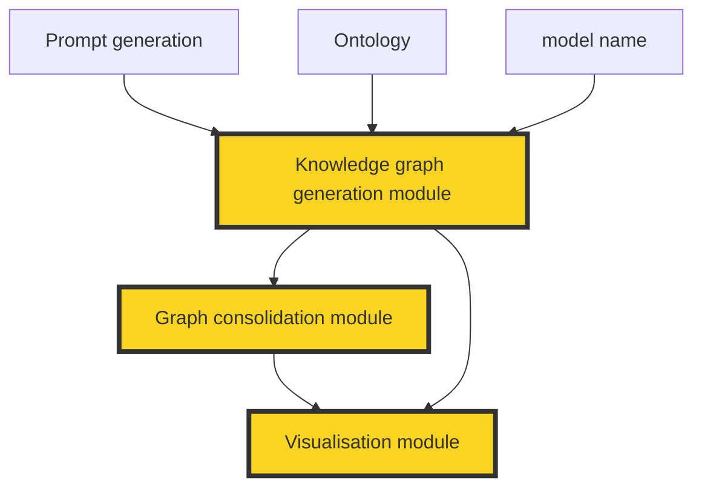

The framework is structured into four primary modules:

### 1. Knowledge Graph Generation Module

The generation module serves as the core component for synthetic knowledge graph creation. It interfaces with various Large Language Models through standardized APIs to transform ontological schemas into RDF-compliant Turtle format graphs.

### 2. Graph Consolidation Module

The consolidation module implements algorithms for intelligent merging of multiple knowledge graphs while maintaining semantic consistency and managing duplicate entities.

### 3. Visualization and Analysis Module

This module provides comprehensive analytical capabilities for knowledge graph assessment and interactive visualization generation.

### 4. Common Utilities Module

Shared infrastructure components providing fundamental operations across all modules.

### 5. Schema

